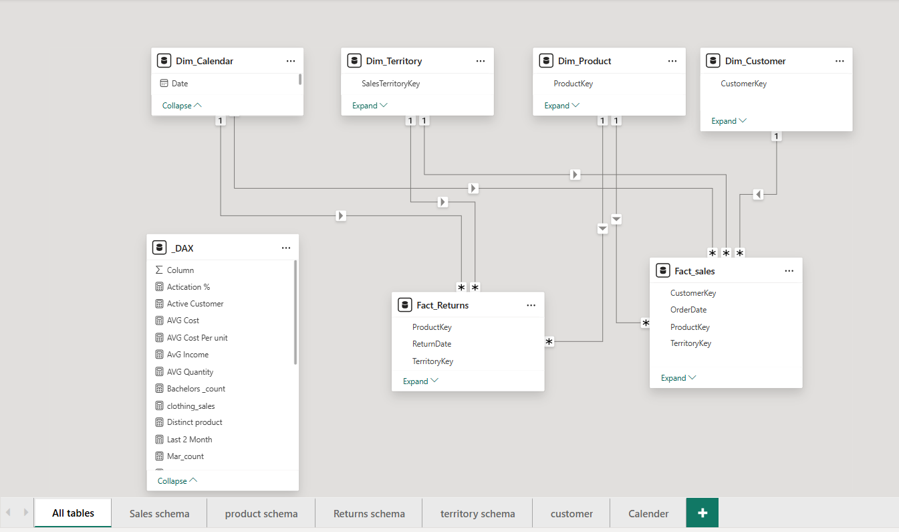
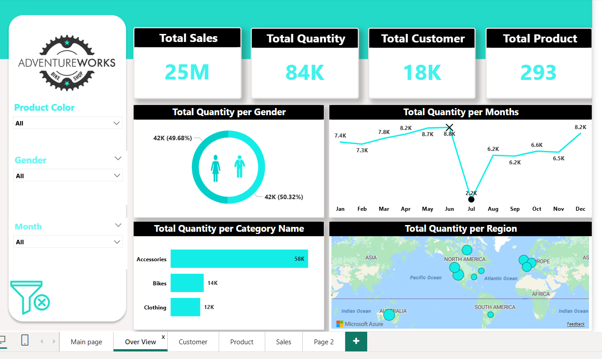
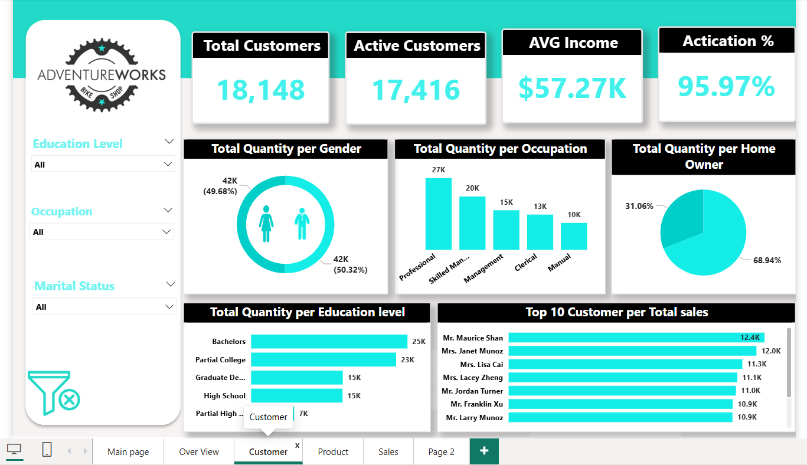
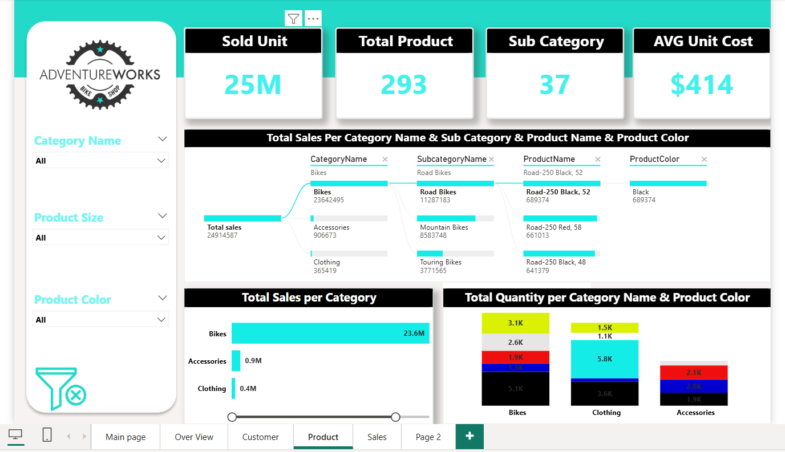
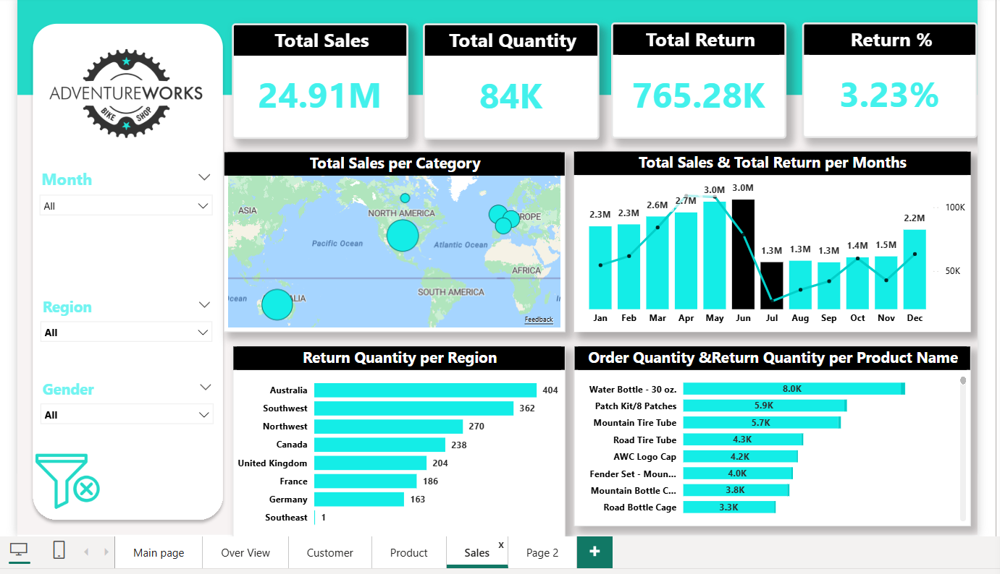

### AdventureWorks Sales Dashboard

### 📊 Project Overview

Interactive Power BI dashboard analyzing sales performance, customer behavior, product insights, and return analytics for AdventureWorks bike shop.
________________________________________
### Data Model Architecture
### Star Schema Design 

• Fact Tables :
- Fact Sales
- Fact Returns
  
• Dimension Tables :

- Dim_Calendar
- Dim_Territory
- Dim_Product
- Dim_Customer

•	DAX Measures Table :
-	20+ calculated measures including KPIs, averages, and time intelligence
________________________________________
### Dashboard Pages

## 1. Overview Page
	Total Sales: 25M
	Total Quantity: 84K
	Total Customers: 18K
	Total Products: 293
•	Visuals: Gender distribution, monthly trends, category breakdown, regional map

## 2. Customer Page
	Total Customers: 18,148
	Active Customers: 17,416
    Average Income: $57.27K
	Activation Rate: 95.97%
•	Visuals: Education level, occupation, home ownership, top 10 customers
## 3. Product Page
	Sold Units: 25M
	Total Products: 293
	Sub Categories: 37
	Average Unit Cost: $414
•	Visuals: Category hierarchy, sales by category, color analysis
## 4. Sales & Returns Page
	Total Sales: 24.91M
	Total Returns: 765.28K
	Return Rate: 3.23%
•	Visuals: Regional returns, monthly sales vs returns, product return analysis
________________________________________
###  Interactive Features
•	Slicers for: Product Color, Gender, Month, Education Level, Occupation, Marital Status, Category Name, Product Size, Region
•	Drill-through capabilities
•	Cross-filtering across all pages
________________________________________
### Tools & Technologies
•	Power BI Desktop
•	DAX (Data Analysis Expressions)
•	Star Schema Data Modeling
•	Power Query for ETL
________________________________________
### Screenshots
### Data Model

### Overview Dashboard

### Customer Analysis

### Product Insights

### Sales & Returns

____________________________________________________
### Demo Video
https://drive.google.com/file/d/10bAW_dQV5AM253r4mkhngR0bHwtZeCsY/view?usp=sharing
___________________________________________________

### Project File

https://drive.google.com/file/d/10bAW_dQV5AM253r4mkhngR0bHwtZeCsY/view?usp=sharing
_________________________________________________
### How to Use
1.	Download the .pbit file
2.	Open in Power BI Desktop
3.	Connect to your data source
4.	Refresh to load your data
________________________________________
### Author
Rana Mohamed - Data Analyst
